# Incident Investigation Report: HawkEye Keylogger Exfiltration

| Field | Details |
| --- | --- |
| **Analyst** |Sourav Ranjan  |
| **Date** | September 3, 2026 |
| **Lab** | HawkEye (CyberDefenders) |

## 1. Executive Summary
This report details the network forensic investigation of an endpoint compromise involving a phishing vector and subsequent data exfiltration. Upon analyzing the provided stealer.pcap network trace, it was determined that an internal user downloaded a malicious executable disguised as an invoice. The malware, identified as HawkEye Keylogger - Reborn v9, successfully harvested and exfiltrated sensitive web browser credentials (including banking information) and email profile data via SMTP to an external server.

## 2. Investigation Environment & Methodology
To ensure operational security and maintain forensic integrity during this analysis, the following isolated methodology was employed:

- **Initial acquisition:** The lab archive was downloaded to my secure Windows 10 host machine and decrypted/unzipped locally.

- **Secure transfer:** The extracted `stealer.pcap` file was transferred into an isolated Kali Linux VirtualBox virtual machine.

- **Forensic analysis:** All packet inspection, object extraction, and payload hashing were conducted within the Kali VM using natively available tools (Wireshark, cmd, `md5sum`) and browser-based decoders (CyberChef) and intelligence tools like Cisco's TalosIntelligence and VirusTotal.

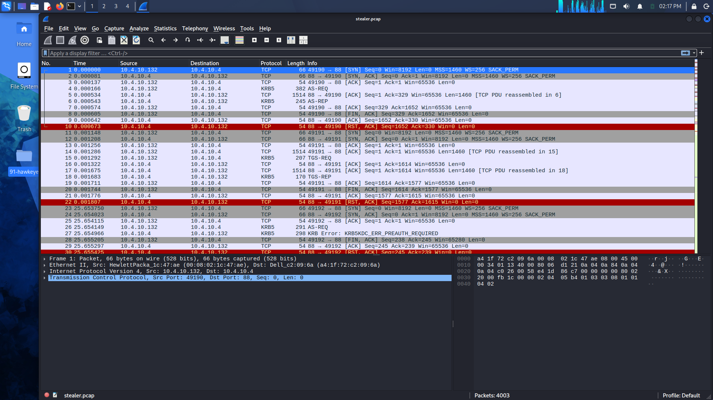
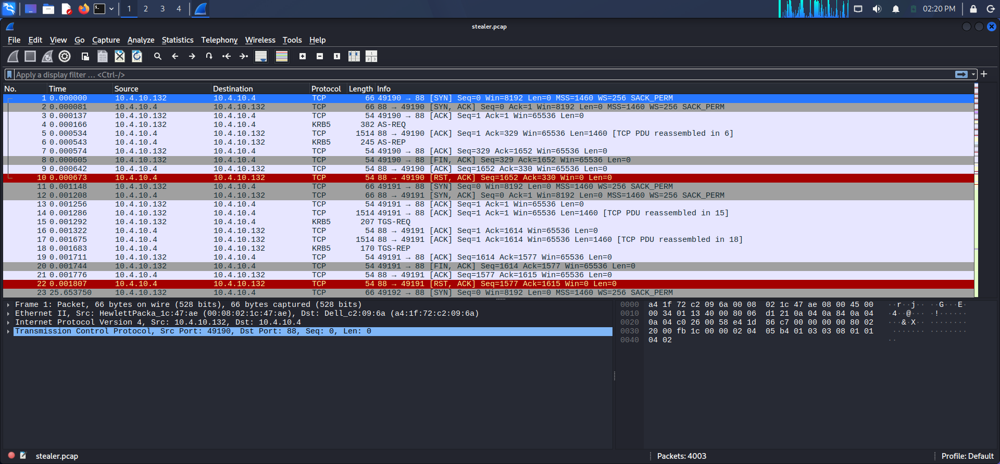

## 3. Step-by-Step Forensic Analysis & Findings

### Phase 1: Capture Triage

#### Question 1: How many packets does the capture have?

Procedure: Establishing a baseline is the first step in any packet analysis. I navigated to Wireshark’s top menu bar, selected Statistics, and opened the Capture File Properties dialogue. Under the "Statistics" tree in this window, the "Measurement" column provides an exact count of all captured and displayed packets, ensuring no packets were dropped or filtered out by mistake.

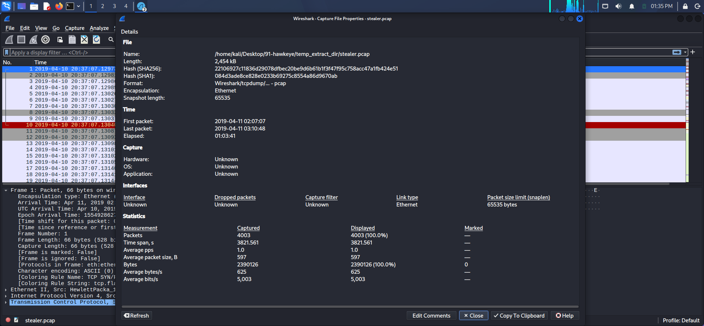

<strong style="color: #9C0006;">Answer:</strong> 4003 packets

#### Question 2: At what time was the first packet captured (UTC)?

Procedure: To maintain a standardized timeline—a critical requirement in SOC environments—I configured Wireshark to display time in Coordinated Universal Time. I navigated to View > Time Display Format and selected UTC Year, Day of Year, and Time of Day. By clicking on the very first packet (Frame 1) in the packet list pane, I extracted the precise start time of the incident capture.

<strong style="color: #9C0006;">Answer:</strong> 2019-04-10 20:37:07

#### Question 3: What is the duration of the capture?

Procedure: Utilizing the Capture File Properties window once again (accessible via Ctrl+Alt+Shift+C), I reviewed the "Time" section. The "Elapsed" field calculates the exact delta between the first and last captured packets, providing the total window of the network trace we are analyzing.

<strong style="color: #9C0006;">Answer:</strong> 01:03:41 (1 hour, 3 minutes, 41 seconds)

### Phase 2: Internal Host Identification

#### Question 4: What is the most active computer at the link level?

Procedure: To identify the primary device involved in the incident, I analyzed Data Link layer traffic. By opening Statistics > Conversations and selecting the Ethernet tab, Wireshark aggregates all MAC-to-MAC communications. I clicked the "Packets" column header to sort the traffic in descending order, immediately highlighting the MAC address responsible for generating the vast majority of the network traffic.

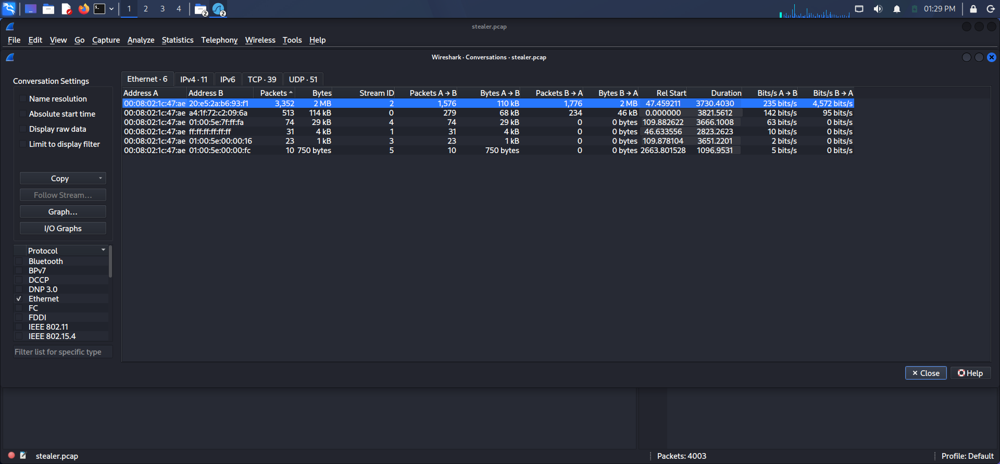

<strong style="color: #9C0006;">Answer:</strong> 00:08:02:1c:47:ae

#### Question 5: Manufacturer of the NIC of the most active system at the link level?

Procedure: Network Interface Cards (NICs) have Organizationally Unique Identifiers (OUIs) built into the first three bytes of their MAC address. Wireshark automatically resolved 00:08:02 in the interface, but to be forensically sound, I verified this prefix using an external web-based MAC vendor lookup tool, confirming the hardware manufacturer of the victim's endpoint.

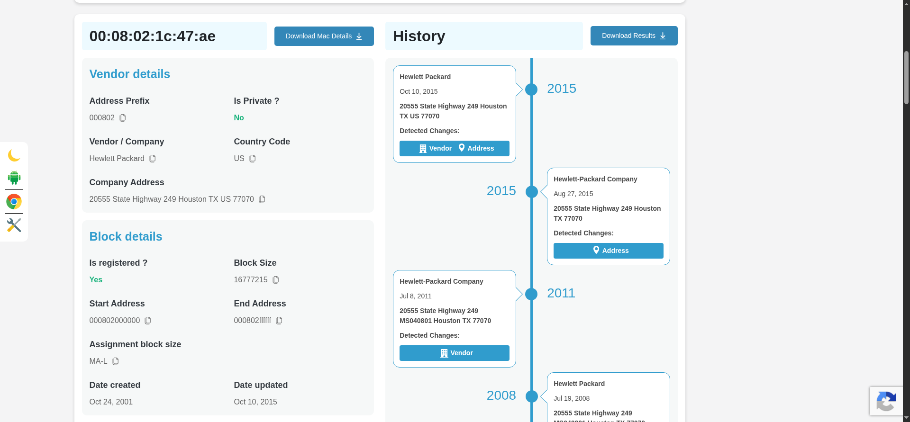

<strong style="color: #9C0006;">Answer:</strong> Hewlett Packard

#### Question 6: Where is the headquarters of the company that manufactured the NIC of the most active computer?

Procedure: With the manufacturer identified as Hewlett Packard, I conducted a brief open-source intelligence (OSINT) gathering exercise via a standard search engine to locate the corporate headquarters of the hardware vendor, which is a common situational awareness practice in extended investigations.

<strong style="color: #9C0006;">Answer:</strong> Palo Alto

#### Question 7: The organization works with private addressing and netmask `/24`. How many computers in the organization are involved in the capture?

Procedure: To map the internal network, I returned to Statistics > Conversations and switched to the IPv4 tab. Knowing the internal IP range is a /24 subnet starting with 10.4.10.x, I visually filtered the list for unique addresses in this block. I counted the active internal endpoints while carefully excluding the broadcast address (10.4.10.255), leaving only the actual computing devices.

<strong style="color: #9C0006;">Answer:</strong> 3 (The endpoints identified are 10.4.10.2, 10.4.10.4, and 10.4.10.132.)

#### Question 8: What is the name of the most active computer at the network level?

Procedure: Having identified 10.4.10.132 as the most active IP, I needed its system hostname. I applied the Wireshark display filter dhcp to isolate DHCP Request and Inform packets broadcasted by this machine when establishing its network connection. By drilling down into the packet details pane under Dynamic Host Configuration Protocol > Option: (12) Host Name, I extracted the plaintext NetBIOS name of the victim's machine.

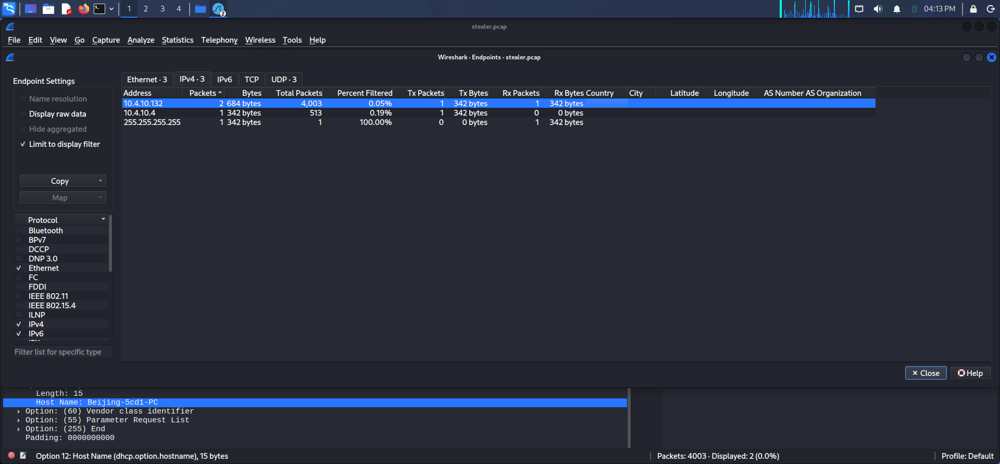
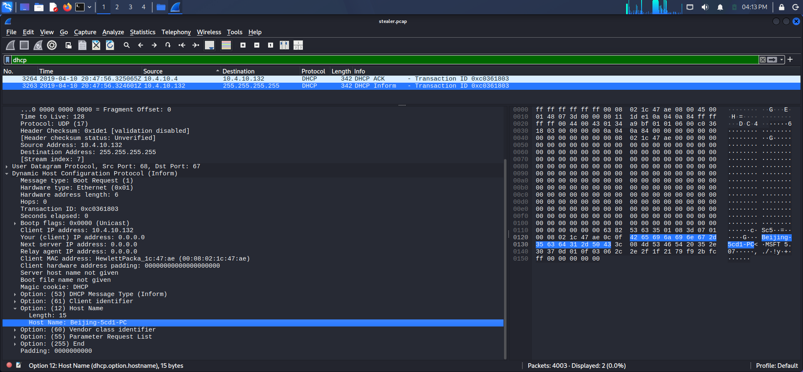

<strong style="color: #9C0006;">Answer:</strong> Beijing-5cd1-PC

### Phase 3: Infection Vector & Malware Delivery

#### Question 9: What is the IP of the organization's DNS server?

Procedure: Endpoints typically forward their domain name resolution requests to a centralized internal DNS server. By applying a filter for standard outbound DNS queries from the victim (ip.src == 10.4.10.132 && dns), I observed all UDP port 53 traffic routing to a single destination IP address, identifying it as the organization's local DNS resolver.

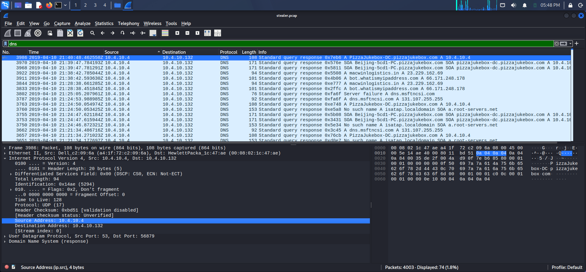

<strong style="color: #9C0006;">Answer:</strong> 10.4.10.4

#### Question 10: What domain is the victim asking about in packet `204`?

Procedure: Utilizing the Go > Go to Packet feature (or pressing Ctrl+G), I jumped directly to Frame 204. I expanded the Domain Name System (query) tree in the packet details pane and inspected the Queries sub-tree to reveal the exact external domain the infected machine was attempting to contact.

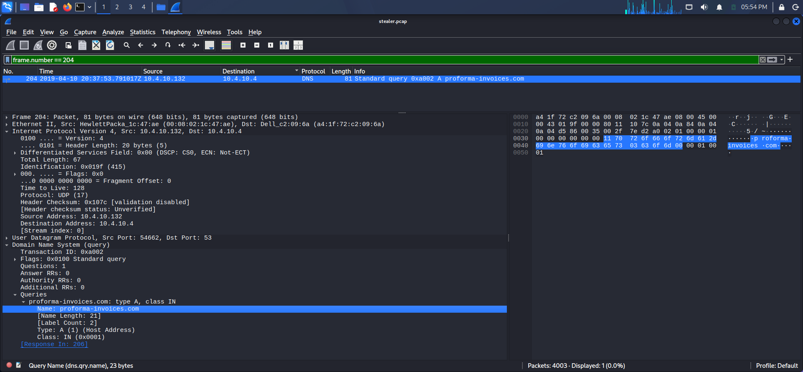

<strong style="color: #9C0006;">Answer:</strong> proforma-invoices.com

#### Question 11: What is the IP of the domain in the previous question?

Procedure: To find the resolved IP address for the malicious domain, I located the corresponding DNS response packet (Frame 206) immediately following the query. By expanding the Answers section of this DNS response, I extracted the Type A record containing the IP address handed back to the victim machine.

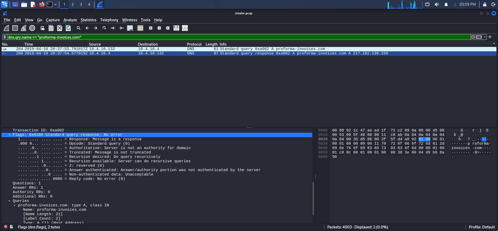

<strong style="color: #9C0006;">Answer:</strong> 217.182.138.150

#### Question 12: Indicate the country to which the IP in the previous section belongs.

Procedure: Malicious infrastructure is often hosted overseas. I took the resolved IP address (217.182.138.150) and queried it against Cisco Talos Intelligence, a leading threat intelligence and geolocation platform, to determine the physical location of the server hosting the malware payload.

<strong style="color: #9C0006;">Answer:</strong> France

#### Question 13: What operating system does the victim's computer run?

Procedure: Operating system details are routinely leaked in HTTP headers. I applied the filter http.request.method == GET to isolate web requests originating from the victim. By expanding the Hypertext Transfer Protocol section of a GET request, I analyzed the User-Agent string. The string reported Windows NT 6.1, which translates historically to the Windows 7 operating system architecture.

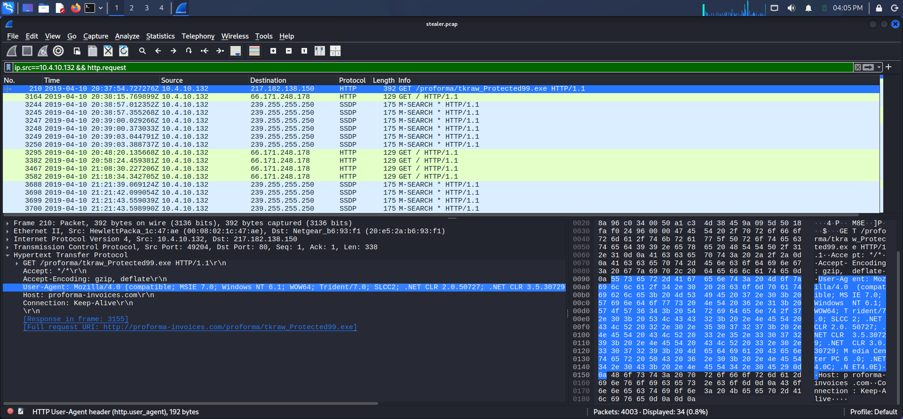

<strong style="color: #9C0006;">Answer:</strong> Windows 7

#### Question 14: What is the name of the malicious file downloaded by the accountant?

Procedure: Within the same HTTP GET request isolated in the previous step, I examined the Request URI field. This field explicitly shows the exact path and file name being requested from the web server. The executable file was masquerading as a protected invoice to deceive the user.

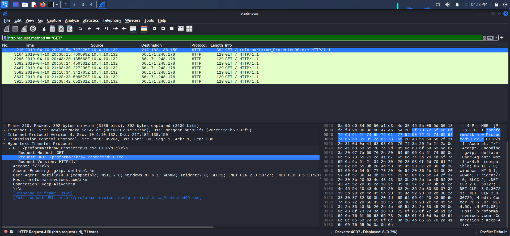

<strong style="color: #9C0006;">Answer:</strong> tkraw_Protected99.exe

#### Question 15: What is the MD5 hash of the downloaded file?

Procedure: To generate a cryptographic Indicator of Compromise (IoC), I needed to extract the malware from the PCAP. I navigated to File > Export Objects > HTTP, located the tkraw_Protected99.exe file, and saved it locally to my Kali environment. I then opened a terminal and executed the md5sum command against the file to generate its unique cryptographic hash for threat intelligence sharing.

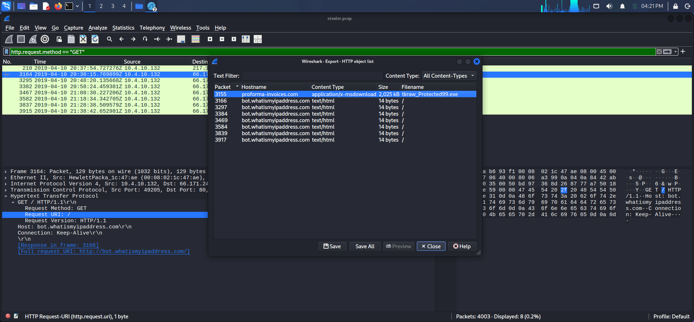
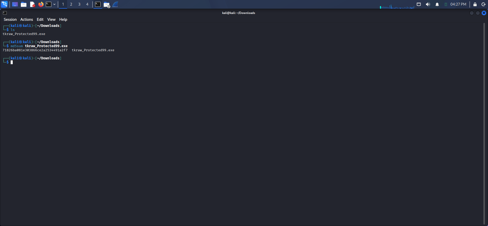

<strong style="color: #9C0006;">Answer:</strong> 71826ba081e303866ce2a2534491a2f7

#### Question 16: What software runs the web server that hosts the malware?

Procedure: I applied the filter http.response && ip.src == 217.182.138.150 to examine the traffic returning from the malicious server. By inspecting the HTTP/1.1 200 OK response packet and looking at the Server: header field, I identified the exact web server software version deployed by the threat actor to host the payload.

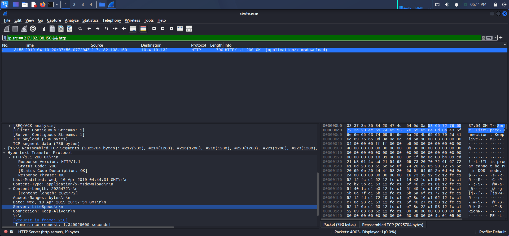

<strong style="color: #9C0006;">Answer:</strong> LiteSpeed

#### Question 17: What is the public IP of the victim's computer?

Procedure: Malware frequently performs environmental checks upon execution, including querying external services to determine its public-facing IP address. I noticed HTTP GET requests to bot.whatismyipaddress.com originating from the victim. By following the HTTP stream or simply viewing the line-based text data of the server's 200 OK response, I observed the victim's public IP returned in plaintext.

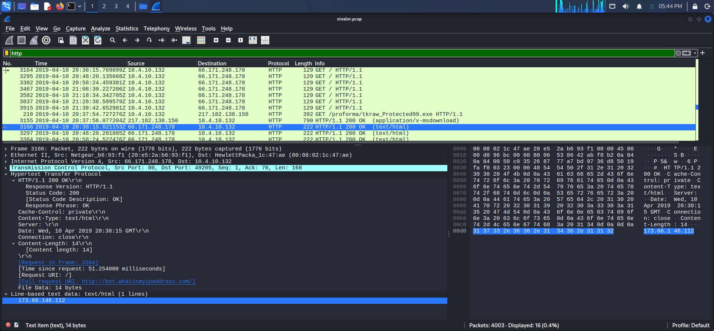

<strong style="color: #9C0006;">Answer:</strong> 173.66.146.112

### Phase 4: Data Exfiltration Analysis

#### Question 18: In which country is the email server to which the stolen information is sent?

Procedure: Knowing HawkEye Keylogger heavily relies on email for exfiltration, I filtered the capture for smtp traffic. This immediately revealed outbound connections to a destination IP (23.229.162.69). I utilized a Whois and IP geolocation lookup tool i.e. VirusTotal on this address to determine where the stolen data was being geographically routed.

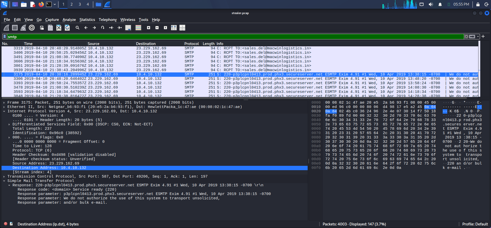

<strong style="color: #9C0006;">Answer:</strong> United States

#### Question 19: Analyzing the first extraction of information, what software runs the email server to which the stolen data is sent?

Procedure: To profile the adversary's infrastructure, I right-clicked the first SMTP packet and selected Follow > TCP Stream. The very first line of the resulting stream displays the SMTP server's greeting banner (starting with 220-), which publicly broadcasts the Mail Transfer Agent (MTA) software and version currently running on the server.

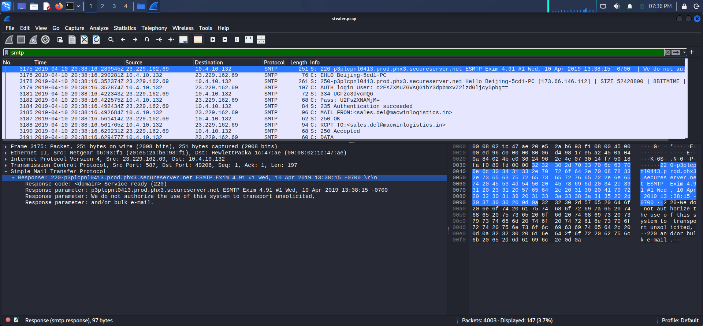

<strong style="color: #9C0006;">Answer:</strong> Exim 4.91

#### Question 20: To which email account is the stolen information sent?

Procedure: Continuing to analyze the SMTP TCP stream, I reviewed the procedural commands sent by the malware. The RCPT TO: command dictates the ultimate destination of the email, revealing the specific drop address the threat actor configured the malware to utilize.

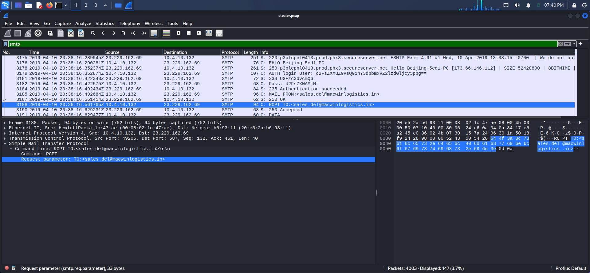

<strong style="color: #9C0006;">Answer:</strong> sales.del@macwinlogistics.in

#### Question 21: What is the password used by the malware to send the email?

Procedure: The malware authenticated to the SMTP server using basic AUTH LOGIN, which transmits credentials encoded in Base64 rather than robust encryption. I identified the Base64 strings sent after the username, copied the password string (U2FsZXNAMjM=), and utilized CyberChef's "From Base64" recipe to translate it back into plaintext.

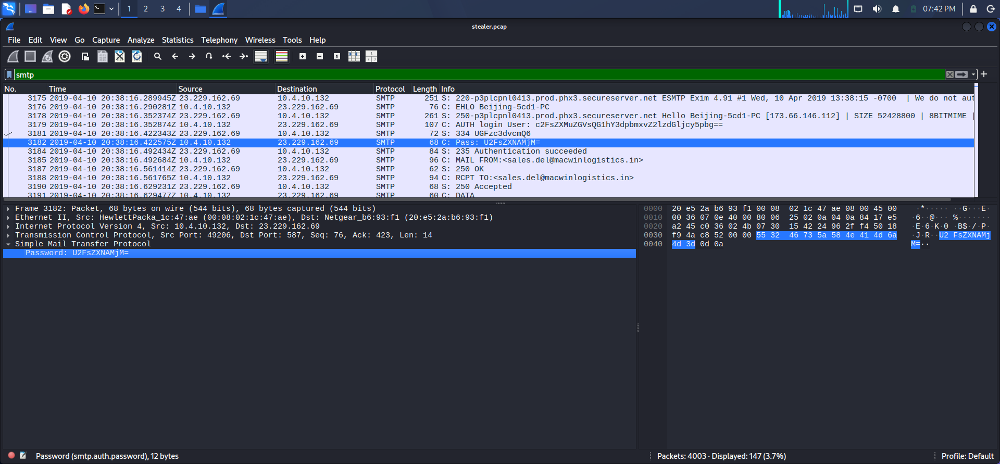

<strong style="color: #9C0006;">Answer:</strong> Sales@23

#### Question 22: Which malware variant exfiltrated the data?

Procedure: The actual stolen data was transmitted in the body of the email via the SMTP DATA command. Because the email content was also encoded, I copied the entire block of Base64 text and ran it through CyberChef. Reading the decoded plaintext revealed a highly structured log file; the very first line of this log acts as a signature, proudly displaying the name and version of the keylogger.

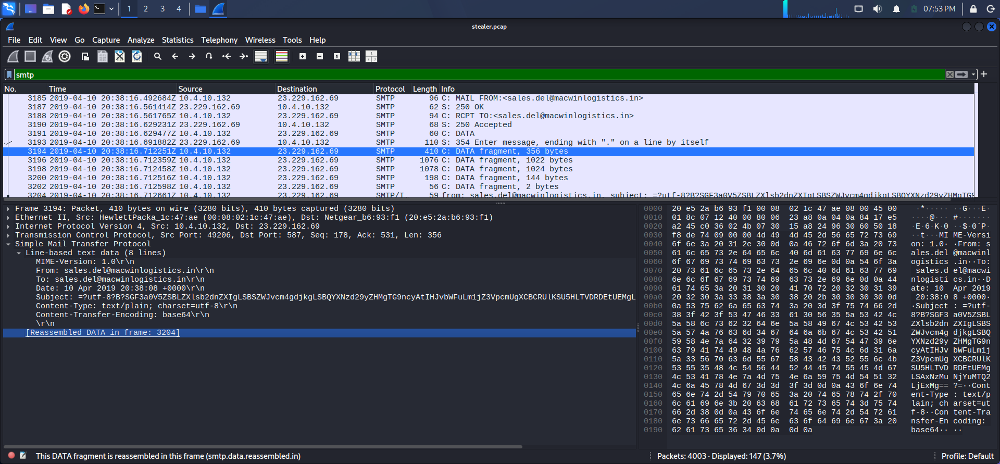
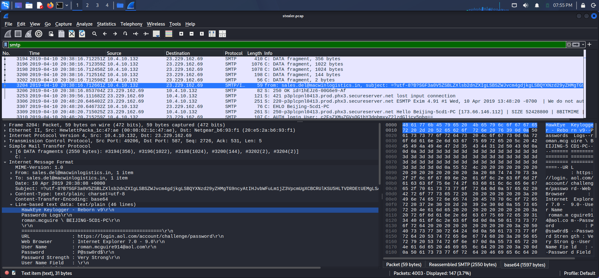

<strong style="color: #9C0006;">Answer:</strong> HawkEye Keylogger - Reborn v9

#### Question 23: What are the Bank of America access credentials? (username:password)

Procedure: Still reviewing the decoded plaintext log extracted in the previous step, I searched for instances of targeted financial institutions. Under the URL: [https://www.bankofamerica.com/](https://www.bankofamerica.com/) section, the keylogger had successfully captured and recorded the keystrokes for the user's banking login, detailing both the username and password fields.

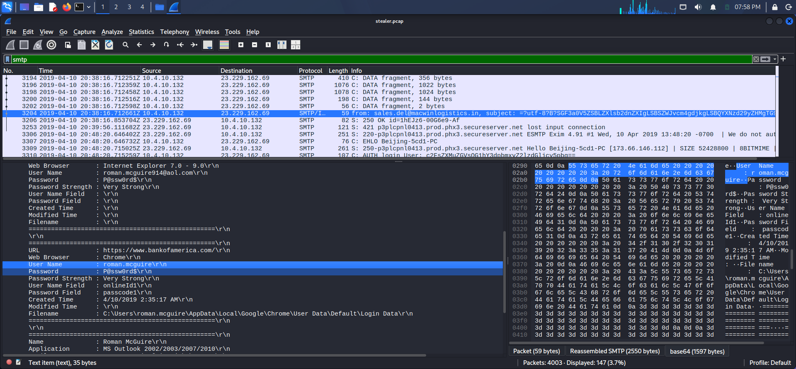

<strong style="color: #9C0006;">Answer:</strong> roman.mcguire:P@ssw0rd$

#### Question 24: Every how many minutes does the collected data get exfiltrated?

Procedure: To understand the Command and Control (C2) beaconing behavior, I filtered for smtp and focused on the EHLO commands that initiate a new exfiltration session. By examining the timestamp column and calculating the delta between the start of each session (e.g., 20:38:16, then 20:48:20, then 20:58:24), a clear, automated exfiltration interval became apparent.

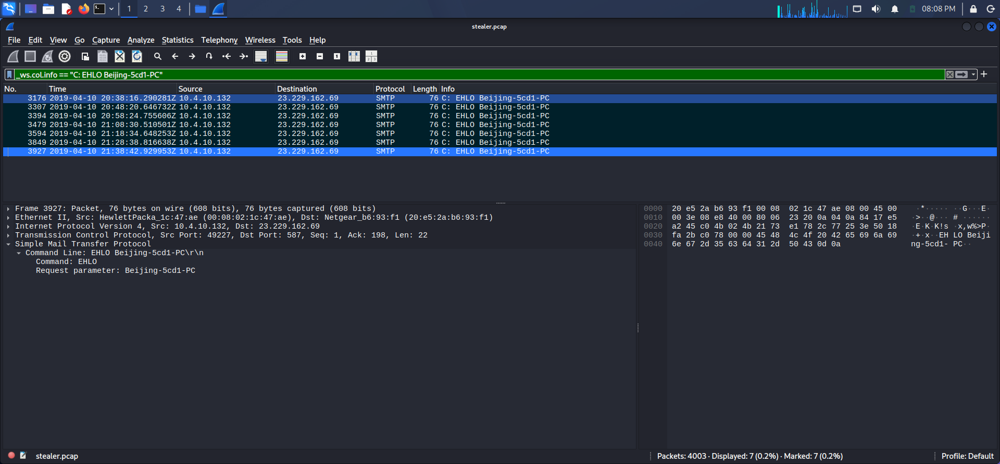

<strong style="color: #9C0006;">Answer:</strong> 10 minutes

## Conclusion & Key Takeaways

### Incident Summary & Business Impact

This analysis reconstructed a phishing-driven data exfiltration incident. The victim, an accountant on `Beijing-5cd1-PC`, downloaded a malicious invoice, covertly installing **HawkEye Keylogger - Reborn v9**. HawkEye scraped local browsers and logged keystrokes to steal high-value financial (Bank of America) and corporate email (Outlook) credentials. This stolen data was then exfiltrated every 10 minutes via SMTP using a compromised email account.

### Professional Value Gained: What I Learned

Through this lab, I reinforced several core network forensics skills:

- **Exfiltration anatomy:** Gained hands-on experience tracking how malware hides command and control (C2) and data leakage within common protocols (HTTP, SMTP).
- **Payload decoding:** Learned to identify, extract, and decode Base64 payloads, including authentication strings and stolen logs, using CyberChef.
- **Forensic workflow:** Practiced establishing UTC timelines, applying targeted Wireshark filters (`dhcp`, `http`, `smtp`), and extracting malicious network objects for IOC hashing.

### Remediation & Defense Recommendations

To prevent similar incidents, the following mitigations are recommended:

1. **Multi-Factor Authentication (MFA):** Ensures that even if a keylogger captures a password, attackers cannot easily reuse it.
2. **Egress filtering:** Block unauthorized outbound traffic, such as SMTP traffic originating from user endpoints instead of mail servers, to disrupt exfiltration channels.
3. **Email security:** Deploy automated sandboxing for links and attachments to catch unknown threats before they reach the inbox.
4. **Security awareness:** Conduct targeted anti-phishing training for high-risk departments to help them identify spoofed invoices.

---

*End of report*
